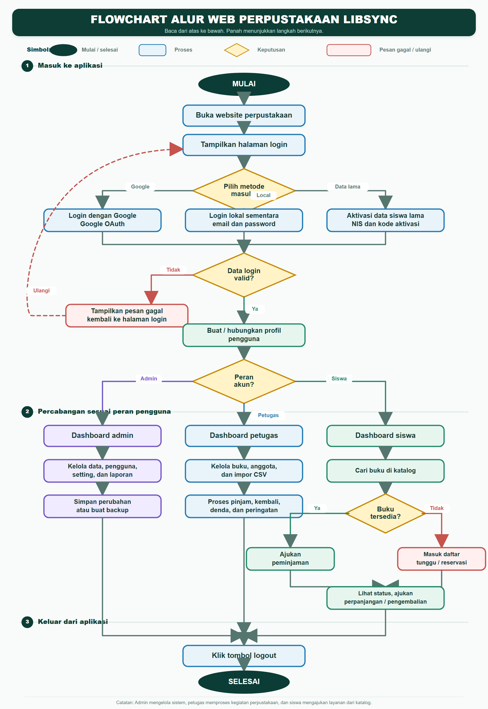
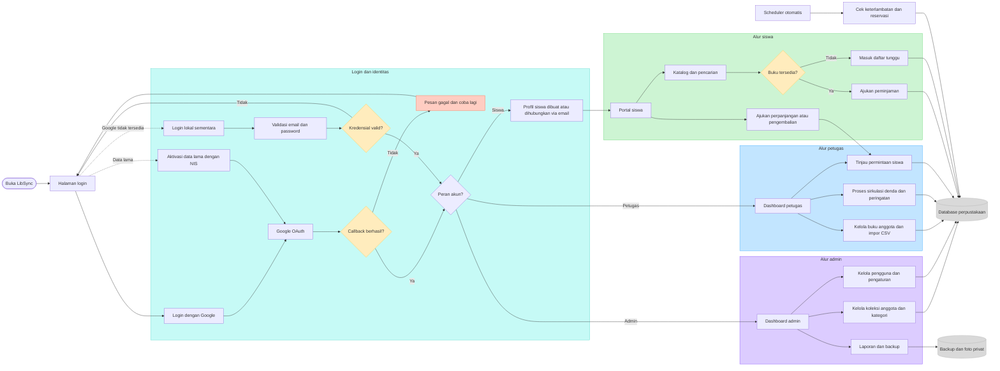
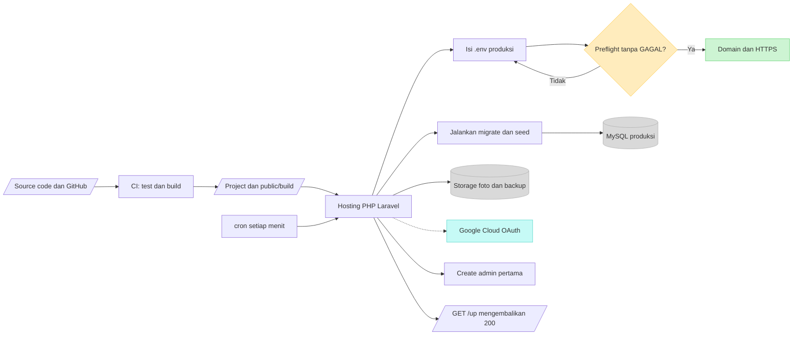

# Flowchart LibSync

Dokumen ini menggambarkan alur utama project LibSync dari login sampai
operasional perpustakaan dan pemasangan domain.

Gambar ini memakai simbol flowchart umum: oval untuk mulai/selesai, persegi
panjang untuk proses, belah ketupat untuk keputusan, dan panah untuk arah alur.

## 1. Alur pengguna dan operasional

## 2. Alur deployment dan runtime

## Ringkasan hak akses

| Peran | Akses utama | Batasan |
| --- | --- | --- |
| Admin | Semua modul, pengguna, pengaturan, backup | Tidak ada batasan modul operasional |
| Petugas | Buku, eksemplar, anggota, impor, sirkulasi, denda, laporan | Tidak dapat mengelola admin, petugas, pengaturan, atau backup |
| Siswa | Katalog, peminjaman, daftar tunggu, perpanjangan, pengembalian | Tidak dapat membuka modul administrasi |

## Catatan identitas siswa

Login Google biasa tidak membutuhkan NIS. Sistem menggunakan email Google untuk
membuat atau menghubungkan profil siswa. NIS hanya dipakai pada alur aktivasi
data lama yang memang sudah memiliki kode aktivasi.
